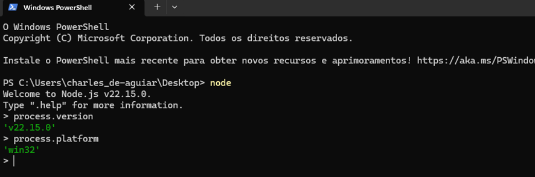

## Node.js — Projeto Guiado
### MÓDULO 1 — FUNDAMENTOS DE BACKEND, JAVASCRIPT MODERNO E NODE.JS


### 3. EXERCÍCIO DE FIXAÇÃO — Backend e responsabilidades 

1. Explique com suas palavras a diferença entre backend, API e banco de dados.
 A API transporta: Ela recebe as requisições do frontend (como um aplicativo ou site), válida se os dados estão corretos e entrega a resposta.
O Backend processa: É onde fica a inteligência. Ele executa as regras de negócio, calcula o que for preciso e decide o que fazer com os dados.
 O Banco de Dados armazena: É o local de persistência definitiva. A API e o backend consultam ou salvam informações nele.
 2. No domínio de agendamentos, escreva três regras que devem obrigatoriamente ser garantidas no backend. 
CPF = cliente
D/M = o dia e o mês 
HRS = que horas vai ser o agendamento 

3. Classifique cada item como validação sintática ou regra de negócio: e-mail sem @; preço negativo; conflito de horário; CPF com quantidade errada de dígitos; serviço desativado sendo agendado.
validação sintática:
e-mail sem @;
 CPF com quantidade errada de dígitos;
regra de negócio:
preço negativo: (garante a lógica comercial do sistema).  
serviço desativado sendo agendado: (valida o status comercial do serviço).
Conflito de horário: Regra de negócio (valida a lógica da agenda cruzando dados)

•	 Desafio profissional: Escolha um sistema que você já utiliza e desenhe, em até seis blocos, o caminho de uma ação do usuário até a persistência dos dados.

[ 1. Usuário (Tela) ] ──> Clica em "Confirmar Pedido" enviando os dados do carrinho.
         │
[ 2. API (Rota) ] ──────> Recebe a requisição (POST /pedidos) e repassa para o servidor.
         │
[ 3. Backend (Lógica) ] ─> Verifica se o restaurante está aberto e se há estoque.
         │
[ 4. Banco de Dados ] ──> Salva o pedido no banco (status: "pendente") para persistir.
         │
[ 5. Resposta ] ────────> Retorna para a tela do usuário a mensagem: "Pedido Confirmado!".

### 4.2 Executando arquivos

#### EXERCÍCIO DE FIXAÇÃO — Runtime 
1. Explique por que console.log pode existir no navegador e no Node.js, embora os dois ambientes sejam diferentes. 
O console.log existe em ambos os ambientes porque, embora o Node.js e o navegador sejam plataformas diferentes, eles compartilham o mesmo motor JavaScript e implementam uma especificação comum para facilidade dos desenvolvedores..

2. Pesquise no REPL o resultado de process.version e process.platform e explique o que cada propriedade representa.
 
> process.version
'v22.15.0' =  // Exemplo: indica a versão do Node.js
> process.platform
'win32 = // Exemplo: indica o sistema (win32, linux ou darwin)

3. Liste três recursos que fazem sentido no Node.js, mas não são responsabilidades típicas de uma página no navegador.

1. Manipulação do Sistema de Arquivos (Módulo fs)
•	O que faz: Lê, cria, edita e deleta arquivos e pastas diretamente no disco rígido do servidor.
•	No navegador: É proibido por segurança para evitar que sites maliciosos acessem ou apaguem arquivos do computador do usuári
2. Criação de Servidores HTTP e Redes (Módulo http)
•	O que faz: Escuta portas de rede (como a porta 80 ou 3000) para receber requisições de clientes e estruturar APIs ou servidores web.
•	No navegador: O código roda como um cliente que apenas envia requisições para servidores, sem a capacidade de expor portas ou hospedar serviços para outros usuários.
3. Acesso a Variáveis de Ambiente e Sistema (process.env)
•	O que faz: Acessa chaves secretas, senhas de banco de dados e configurações do sistema operacional de forma segura.
•	No navegador: Não existe acesso ao sistema operacional subjacente. Expor essas variáveis no código do navegador significaria deixá-las visíveis para qualquer usuário que inspecionasse a página.

### - Exercício 19 -3. Explicação Teórica (Pergunta 3 do slide)
Por que process.env.PORT é string e precisa ser convertido?
O objeto process.env lê as variáveis diretamente do sistema operacional ou do ambiente de execução (como Docker, Heroku, AWS). Por padrão e especificação técnica, o sistema operacional armazena e transmite todas as variáveis de ambiente estritamente como cadeias de caracteres (strings).
Mesmo que você defina uma porta numérica (como 3000), o Node.js a receberá como "3000". A conversão usando Number() é obrigatória porque métodos nativos do Node (como o app.listen() do Express ou o módulo node:http) exigem um tipo de dado estritamente numérico para alocar e abrir a porta de rede do servidor de forma correta.
Assim que rodar o comando com os argumentos, me conte:
•	O console imprimiu corretamente o ambiente como production?
•	Os valores "Consulta" e 45 apareceram nos logs?


### - 20 BOAS PRÁTICAS DE CÓDIGO PARA BACKEND
O que mudou aqui (Respostas dos pontos 1, 2 e 3):
•	Ponto 1 (Renomear): As variáveis genéricas (a, b, x) viraram nomes legíveis e autoexplicativos (valorTotalVenda, taxaComissaoPercentual, valorComissaoFinal).
•	Ponto 2 (Extrair validação): A validação foi isolada na função descritiva verificarSeValorEhValido.
•	Ponto 3 (Comentários ruins): Em vez de colocar um comentário óbvio como // multiplica a por b, usamos um comentário focado no porquê da regra de negócio (o teto máximo de comissão).


# Atividade 26.1 — Diagnóstico de Código e Refatoração Pragmática

Este repositório contém a resolução da atividade prática de diagnóstico, análise e refatoração de código com foco nas boas práticas de desenvolvimento backend em Node.js (Módulo 1).

---

## 1. Diagnóstico de Código: 10 Problemas Identificados

### Problema 1: Uso obsoleto de `var` para declaração de variáveis
* **Trecho:** `var x = []; var contador = 1; var achou = null;`
* **Justificativa:** O uso de `var` ignora o escopo de bloco e sofre de *hoisting*, permitindo que variáveis vazem para escopos indesejados. Isso reduz a previsibilidade da aplicação e aumenta a chance de bugs colaterais de reatribuição.
* **Correção:** Substituir por `const` para variáveis que não sofrerão reatribuição (como arrays e objetos) e `let` para estruturas de controle locais que precisam ser alteradas.

### Problema 2: Nomenclatura genérica e não expressiva (Valores mágicos/Variáveis sem intenção)
* **Trecho:** `function fazer(a, b, c) { ... }` e `var x = [];`
* **Justificativa:** Os nomes `x`, `a`, `b`, `c`, `n` e `fazer` violam os princípios do Clean Code. Eles não revelam a real intenção dos dados manipulados, dificultando a manutenção do sistema por outros desenvolvedores.
* **Correção:** Renomear `x` para `services`, `fazer` para `createService`, e os argumentos `a`, `b`, `c` para `name`, `durationMinutes` e `price`.

### Problema 3: Uso de comparação fraca (`==`) e coerção implícita de tipos
* **Trecho:** `if (a == undefined || a == "")` e `if (x[i].id == id)`
* **Justificativa:** O operador `==` tenta converter os tipos implicitamente antes de comparar. Isso pode gerar falsos positivos perigosos em Javascript (ex: comparar o número `0` ou uma string vazia `""` com `false` pode ser considerado idêntico). Além disso, permite comparar IDs de tipos diferentes (`string` com `number`) sem validação rígida.
* **Correção:** Utilizar estritamente o operador de igualdade estrita (`===`) para comparar valor e tipo ao mesmo tempo.

### Problema 4: Representação inadequada de estado booleano
* **Trecho:** `ativo: "sim"` e `x[i].ativo = "nao";`
* **Justificativa:** Usar strings literais como `"sim"` ou `"nao"` para flags de status é ineficiente e propenso a erros de digitação (ex: `"Sim"`, `"nao "`). Sistemas profissionais devem representar estados binários usando o tipo primitivo nativo adequado.
* **Correção:** Utilizar tipos booleanos reais (`true` para ativo, `false` para inativo).

### Problema 5: Tratamento de erros ineficiente ("Engolindo erros")
* **Trecho:** `console.log("erro"); return;` e `catch (e) {}`
* **Justificativa:** Dar apenas um `console.log("erro")` silencia a stack-trace original, não interrompe fluxos de execução externos perigosos e deixa a aplicação operando em estado imprevisível. O pior cenário ocorre no `catch (e) {}` vazio de `lerConfig`, que "engole" a exceção de infraestrutura completamente, ocultando falhas críticas do sistema.
* **Correção:** Lançar instâncias reais de erros com `throw new Error("MENSAGEM")` na validação e registrar logs amigáveis ou stack traces completas no ponto de captura correto.

### Problema 6: Busca ineficiente por iteração completa (Falta de break/Early return)
* **Trecho:** No laço `for` da função `buscar`, a iteração continua até o final do array mesmo após encontrar o item desejado.
* **Justificativa:** Desperdício desnecessário de processamento (Complexidade computacional). Se o item for o primeiro de uma lista de 10.000 itens, o laço rodará outras 9.999 vezes sem necessidade, reatribuindo a variável.
* **Correção:** Interromper o fluxo utilizando métodos nativos modernos de alta ordem como o `.find()` ou aplicando uma cláusula de interrupção imediata.

### Problema 7: Quebra de encapsulamento e vazamento de mutabilidade por referência
* **Trecho:** `function listar() { return x; }`
* **Justificativa:** Em JavaScript, arrays e objetos são passados por referência. Retornar `x` diretamente expõe o estado interno do banco de dados simulado. Qualquer código externo que chame `listar()` poderá, acidentalmente ou maliciosamente, alterar ou esvaziar o array original sem passar pelas validações.
* **Correção:** Proteger o estado retornando uma nova cópia profunda (deep copy) ou superficial (shallow copy) mapeada do array usando o operador spread ou `.map()`.

### Problema 8: Permissão de duplicidade de chaves de negócio (Unicidade)
* **Trecho:** O código executa `fazer("Consulta", ...)` e `fazer("consulta", ...)` consecutivamente sem disparar alertas.
* **Justificativa:** Violação grave de integridade de dados. O sistema permite cadastrar infinitos serviços com nomes idênticos, diferenciando-os apenas por letras maiúsculas ou minúsculas, gerando inconsistência crônica no catálogo de dados.
* **Correção:** Adicionar uma regra de aplicação na camada de serviço que verifique a existência do nome ignorando maiúsculas, minúsculas e espaços extras.

### Problema 9: Divisão por Zero potencial no cálculo estatístico
* **Trecho:** `return soma / quantidade;` na função `media()`
* **Justificativa:** Se a função for executada quando o array estiver vazio ou quando todos os serviços estiverem desativados, a variável `quantidade` será `0`. Em JavaScript, `soma / 0` resulta em `NaN` ou `Infinity`, quebrando exibições visuais no front-end.
* **Correção:** Utilizar um operador ternário ou curto-circuito para validar se a quantidade é maior que zero antes de realizar a divisão, retornando `0` como fallback seguro.

### Problema 10: Falta de coesão e quebra de responsabilidade única (Monolito em arquivo único)
* **Trecho:** Todo o arquivo `src/app.js` unificando o banco de dados simulado, as regras de validação, as operações de leitura de variáveis de ambiente do sistema operacional, funções assíncronas e scripts de teste de console.
* **Justificativa:** Arquivos gigantes com responsabilidades misturadas são de difícil manutenção, impossibilitam testes unitários automatizados isolados e ferem os princípios do SOLID (Responsabilidade Única).
* **Correção:** Separar a aplicação seguindo uma arquitetura modular de três camadas: Validador (`service-validator.js`), Repositório (`service-repository.js`) e Serviço/Regras de negócio (`service-service.js`).

---

## 2. Estrutura de Pastas Implementada

A aplicação foi reestruturada seguindo os padrões arquiteturais de separação de responsabilidades exigidos no backend:

```text
src/
├── app.js
└── modules/
    └── services/
        ├── service-validator.js
        ├── service-repository.js
        └── service-service.js
```

---

## 3. Arquitetura do Sistema Refatorado

### Validador de Domínio (`src/modules/services/service-validator.js`)
```javascript
// Remove espaços sobressalentes no meio e nas pontas das strings
function normalizeName(value) {
    return value ? value.trim().replace(/\s+/g, " ") : "";
}

export function validateServiceInput(input) {
    const name = normalizeName(input?.name);
    const durationMinutes = Number(input?.durationMinutes);
    const price = Number(input?.price);

    if (!name || name === "") {
        throw new Error("FORMATO_INVALIDO: O nome do serviço é obrigatório e não pode ser vazio.");
    }

    if (isNaN(durationMinutes) || durationMinutes <= 0) {
        throw new Error("FORMATO_INVALIDO: A duração deve ser um número maior que zero.");
    }

    if (isNaN(price) || price < 0) {
        throw new Error("FORMATO_INVALIDO: O preço não pode ser negativo.");
    }

    return { name, durationMinutes, price };
}
```

### Repositório de Dados em Memória (`src/modules/services/service-repository.js`)
```javascript
const servicesTable = [];
let idSequenceCounter = 1;

export function save(serviceData) {
    const record = {
        id: String(idSequenceCounter++),
        ...serviceData,
        active: true,
        createdAt: new Date().toISOString()
    };
    servicesTable.push(record);
    return { ...record };
}

export function findByName(name) {
    const normalizedSearch = name.trim().toLocaleLowerCase("pt-BR");
    return servicesTable.find(
        (s) => s.name.toLocaleLowerCase("pt-BR") === normalizedSearch
    ) || null;
}

export function findById(id) {
    return servicesTable.find((s) => s.id === String(id)) || null;
}

export function update(id, partialData) {
    const index = servicesTable.findIndex((s) => s.id === String(id));
    if (index === -1) return null;
    
    servicesTable[index] = { ...servicesTable[index], ...partialData };
    return { ...servicesTable[index] };
}

export function findAll() {
    // Retorna cópias profundas protegendo o array original contra mutações externas
    return servicesTable.map((s) => ({ ...s }));
}
```

### Camada de Serviço e Regras de Negócio (`src/modules/services/service-service.js`)
```javascript
import * as repository from "./service-repository.js";
import { validateServiceInput } from "./service-validator.js";

export function createService(input) {
    const validatedData = validateServiceInput(input);

    // Validação de unicidade para evitar duplicidade de regras de negócio
    const targetExists = repository.findByName(validatedData.name);
    if (targetExists) {
        throw new Error(`CONFLITO: O serviço com o nome "${validatedData.name}" já está cadastrado.`);
    }

    return repository.save(validatedData);
}

export function searchServiceByName(name) {
    return repository.findByName(name);
}

export function getAllServices() {
    return repository.findAll();
}

export function deactivateServiceById(id) {
    const service = repository.findById(id);
    if (!service) {
        throw new Error("NOT_FOUND: Serviço não localizado para desativação.");
    }
    return repository.update(id, { active: false });
}

export function calculateAveragePriceOfActiveServices() {
    const activeServices = repository.findAll().filter((s) => s.active);
    
    if (activeServices.length === 0) return 0;

    const totalPriceSum = activeServices.reduce((sum, s) => sum + s.price, 0);
    return totalPriceSum / activeServices.length;
}

### src/app.js 

import { 
    createService, 
    searchServiceByName, 
    getAllServices, 
    deactivateServiceById, 
    calculateAveragePriceOfActiveServices 
} from "./modules/services/service-service.js";

function loadServerConfig() {
    // Tratamento de erro explícito com coerção segura de tipo numérico
    try {
        const port = Number(process.env.PORT) || 3000;
        console.log(`[Config] Servidor configurado para rodar na porta: ${port}`);
    } catch (error) {
        console.error("[Erro Infraestrutura] Falha ao ler variáveis de ambiente:", error.message);
    }
}

async function loadInitialDataMock() {
    // Processamento assíncrono coerente com tratamento de Promises
    return Promise.resolve("Módulo Assíncrono: Dados de cache carregados com sucesso.");
}

// Execution Sandbox (Fluxo Principal)
async function runApplication() {
    console.log("=== INICIANDO SISTEMA DE DIAGNÓSTICO REFATORADO ===");
    loadServerConfig();

    // 1. Testes de cadastro com cenários válidos e captura de fluxos inválidos
    console.log("\nExecutando Cadastros...");
    try {
        const s1 = createService({ name: "Consulta", durationMinutes: 45, price: 150 });
        console.log(`✔️ Cadastrado com sucesso: ${s1.name} (ID: ${s1.id})`);
    } catch (e) { console.error(`✖️ Erro esperado capturado: ${e.message}`); }

    try {
        // Tentativa de duplicidade (Deve disparar o erro de Conflito)
        createService({ name: "consulta", durationMinutes: 30, price: 100 });
    } catch (e) { console.error(`✖️ Erro esperado capturado: ${e.message}`); }

    try {
        // Tentativa de validação com nome vazio
        createService({ name: "", durationMinutes: 50, price: 90 });
    } catch (e) { console.error(`✖️ Erro esperado capturado: ${e.message}`); }

    try {
        // Tentativa de validação com duração inválida
        createService({ name: "Avaliação", durationMinutes: -10, price: 120 });
    } catch (e) { console.error(`✖️ Erro esperado capturado: ${e.message}`); }

    // 2. Operações de Busca
    console.log("\nExecutando Buscas...");
    const targetService = searchServiceByName("CONSULTA");
    if (targetService) {
        console.log(`☑️ Item localizado: "${targetService.name}" encontrado com sucesso.`);
    }

    // 3. Modificação de Estado (Desativação Controlada por ID de tipo explícito)
    console.log("\nExecutando Desativação...");
    try {
        deactivateServiceById("1");
        console.log("☑️ Serviço ID '1' foi desativado com sucesso.");
    } catch (e) { console.error(`✖️ Falha na desativação: ${e.message}`); }

    // 4. Listagem e Estatísticas
    console.log("\nListagem Geral de Serviços Cadastrados:");
    console.table(getAllServices());

    const averagePrice = calculateAveragePriceOfActiveServices();
    console.log(`📶 Média de preço dos serviços ativos no catálogo: R$ ${averagePrice.toFixed(2)}`);

    // 5. Chamadas Assíncronas Resolvidas de forma Moderna com await
    try {
        const asyncResult = await loadInitialDataMock();
        console.log(`\n⚡ ${asyncResult}`);
    } catch (asyncError) {
        console.error(`✖️ Falha em rotina assíncrona: ${asyncError.message}`);
    }
}

// Inicializa a aplicação protegendo o loop global de eventos
runApplication().catch((err) => console.error("Erro fatal na aplicação:", err));
