# Conteúdo do arquivo: /docker-tutorial-project/docker-tutorial-project/activities/step-by-step-docker.md

# Atividades Passo a Passo sobre Docker

## Atividade 1: Instalação do Docker
1. Acesse o site oficial do Docker.
2. Baixe o instalador adequado para seu sistema operacional.
3. Siga as instruções de instalação.
4. Verifique a instalação executando `docker --version` no terminal.

## Atividade 2: Executando seu primeiro container
1. Abra o terminal.
2. Execute o comando `docker run hello-world`.
3. Observe a saída e explique o que aconteceu.

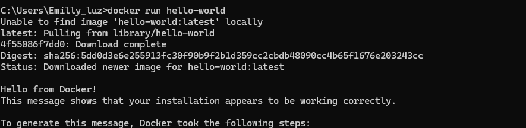

Resposta --> Ele apresentou erro para executar o comando, porém criou um build/container no docker para o hell-world sem imagem, devido ao comando ir sem dados (sem subir algum projeto)

## Atividade 3: Listando containers
1. Execute o comando `docker ps -a`.
2. Explique a diferença entre containers em execução e parados.

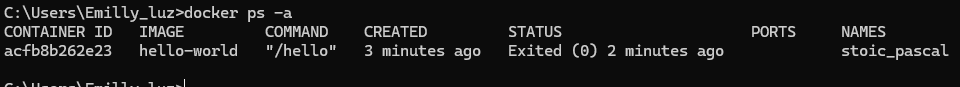

Resposta --> Em execução se trata de containers ativos, estações prontas para serem utilizadas pela equipe/pessoas. Paradas, se tornam inacessiveis e não podem ser acessadas ou 

## Atividade 4: Criando um container interativo
1. Execute `docker run -it ubuntu bash`.
2. Instale um pacote dentro do container (ex: `apt-get update`).
3. Saia do container e verifique se ele ainda está em execução.

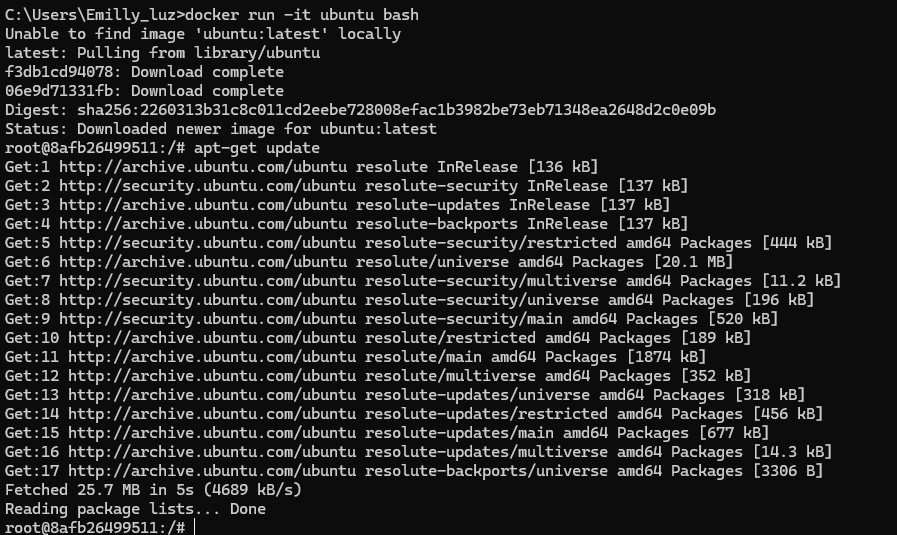

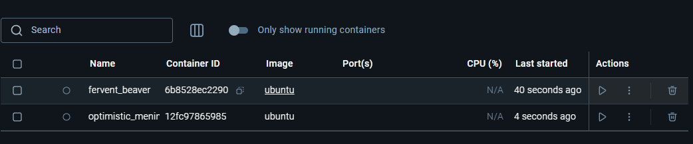 


## Atividade 5: Removendo um container
1. Liste os containers com `docker ps -a`.
2. Remova um container usando `docker rm <container_id>`.

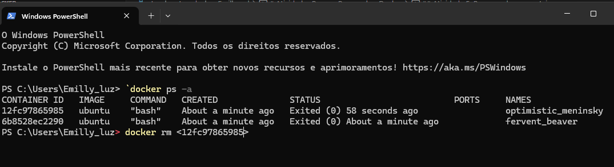

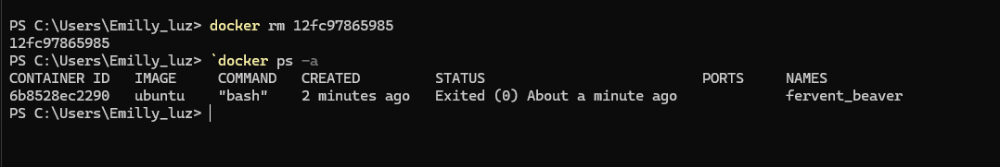 

## Atividade 6: Criando uma imagem Docker
1. Crie um arquivo `Dockerfile` com o seguinte conteúdo:
   ```
   FROM ubuntu
   RUN apt-get update && apt-get install -y curl
   ```
2. Execute `docker build -t minha-imagem .`.
3. Verifique a imagem criada com `docker images`.

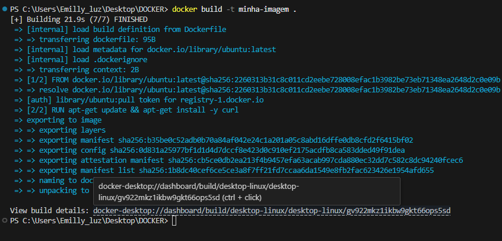

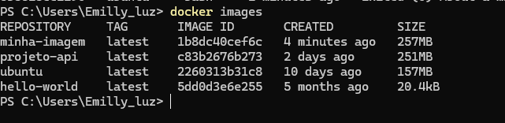

## Atividade 7: Executando uma imagem
1. Execute `docker run minha-imagem`.
2. Explique o que a imagem faz.

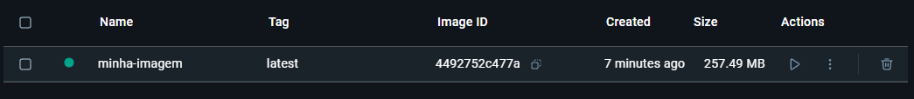

Resposta --> A imagem significa criar um "molde" do ambiente, com tudo que precisa para rodar "em pacotado" conforme o molde. 

## Atividade 8: Criando um container em segundo plano
1. Execute `docker run -d nginx`.
2. Verifique se o container está em execução com `docker ps`.

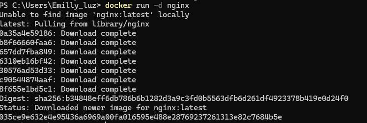

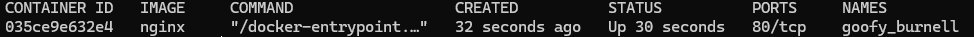

## Atividade 9: Expondo portas
1. Execute `docker run -d -p 8080:80 nginx`.
2. Acesse `http://localhost:8080` no navegador.

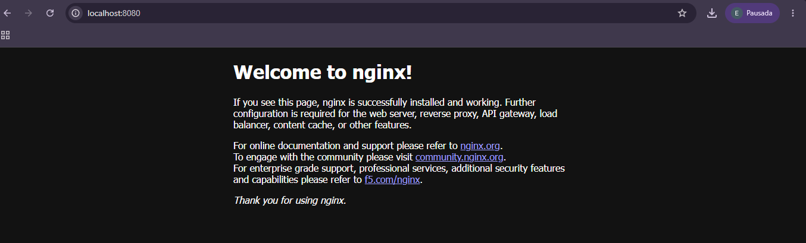

## Atividade 10: Usando volumes
1. Crie um volume com `docker volume create meu-volume`.
2. Execute um container com o volume: `docker run -d -v meu-volume:/data nginx`.
3. Verifique se o volume foi criado com `docker volume ls`.

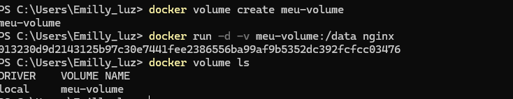

## Atividade 11: Inspecionando um container
1. Execute `docker inspect <container_id>`.
2. Explique as informações obtidas.


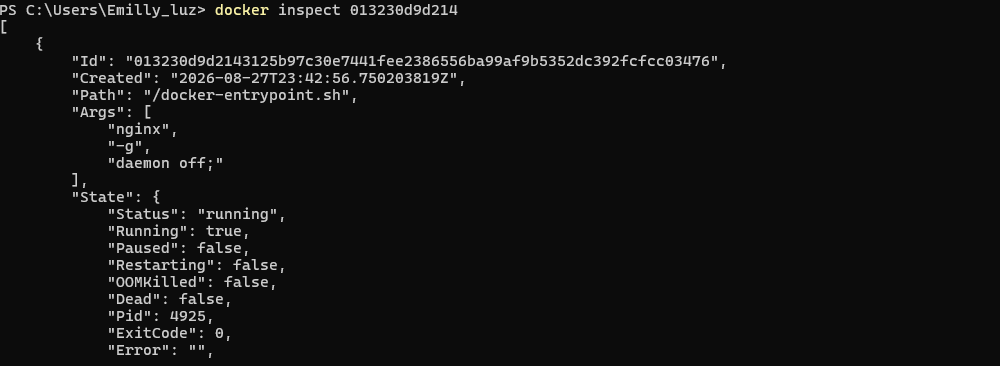

Respostas --> permite visualizar detalhadamente a configuração/informações sobre o container

   ## Atividade 12: Conectando-se a um container em execução
   1. Execute `docker exec -it <container_id> bash`.
   2. Instale um pacote e saia do container.

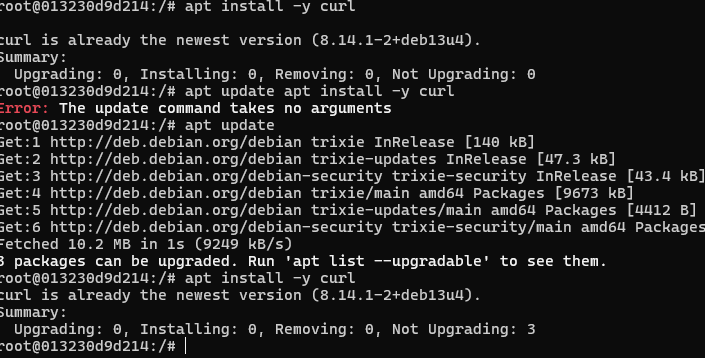


## Atividade 13: Criando uma rede Docker
1. Crie uma rede com `docker network create minha-rede`.
2. Verifique a rede criada com `docker network ls`.

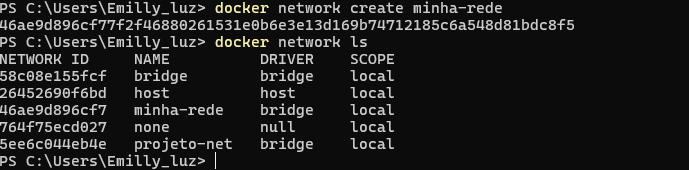

## Atividade 14: Conectando containers à rede
1. Execute dois containers na mesma rede: `docker run -d --network minha-rede --name container1 nginx` e `docker run -d --network minha-rede --name container2 nginx`.
2. Verifique a comunicação entre os containers.

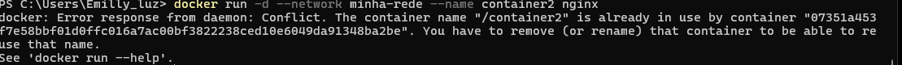


## Atividade 15: Usando Docker Compose
1. Crie um arquivo `docker-compose.yml` com o seguinte conteúdo:
   ```yaml
   version: '3'
   services:
     web:
       image: nginx
       ports:
         - "8080:80"
   ```
2. Execute `docker-compose up`.
3. Acesse `http://localhost:8080`.

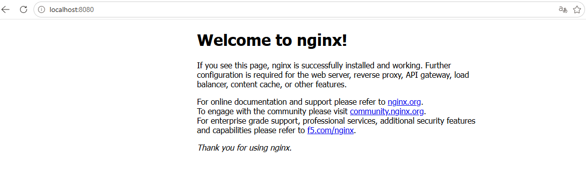

## Atividade 16: Parando serviços com Docker Compose
1. Execute `docker-compose down`.
2. Verifique se os containers foram removidos.

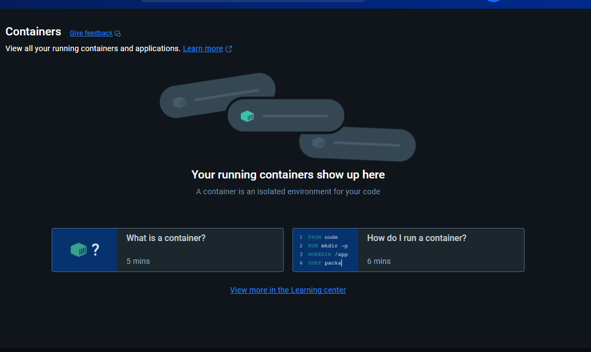

## Atividade 17: Atualizando uma imagem
1. Altere o `Dockerfile` para instalar um novo pacote.
2. Execute `docker build -t minha-imagem .` novamente.
3. Verifique a nova imagem.

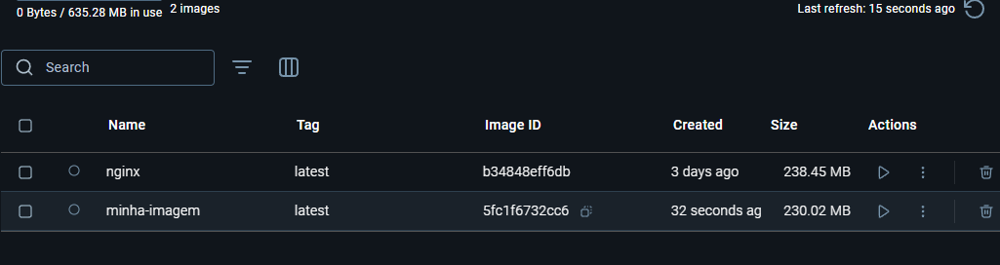

## Atividade 18: Tagging de imagens
1. Execute `docker tag minha-imagem minha-imagem:v1`.
2. Verifique as tags com `docker images`.

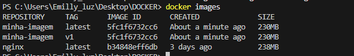

## Atividade 19: Publicando uma imagem no Docker Hub
1. Faça login no Docker Hub com `docker login`.
2. Execute `docker push minha-imagem:v1`.

## Atividade 20: Baixando uma imagem do Docker Hub
1. Execute `docker pull nginx`.
2. Verifique a imagem baixada.

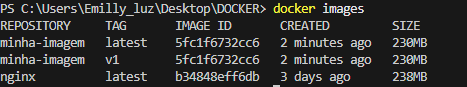

## Atividade 21: Criando um container com variáveis de ambiente
1. Execute `docker run -e "MY_VAR=Hello" ubuntu env`.
2. Verifique a variável de ambiente.

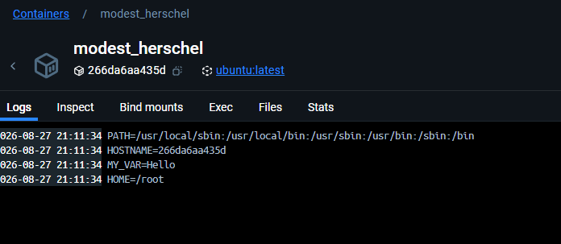

## Atividade 22: Limitando recursos do container
1. Execute `docker run -m 512m --cpus="1.0" ubuntu`.
2. Explique o que foi feito.


Resposta --> por meio deste comando, consigo limitar o quanto recursos do meu computador (RAM...etc), o container vai pode utilizar

## Atividade 23: Usando Dockerfile multi-stage
1. Crie um `Dockerfile` com múltiplas etapas.
2. Execute `docker build -t minha-imagem-multi .`.

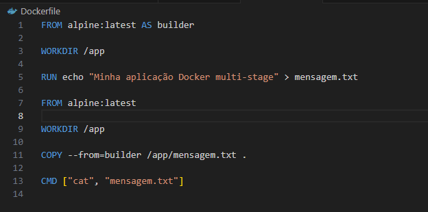

## Atividade 24: Monitorando containers
1. Execute `docker stats`.
2. Explique as métricas apresentadas.

Resposta --> Mostra o quais e quantos os containers estão consumindo, o tanto de memoria sendo usada, o limite (em porcentagem), quantidade de dados sendo recebidos, quantos foram gravados/armazenados na máquina e quantidade de threads em execução dentro do container.

## Atividade 25: Criando um container com um script de inicialização
1. Crie um script `init.sh` e adicione ao seu `Dockerfile`.
2. Execute o container e verifique a execução do script.

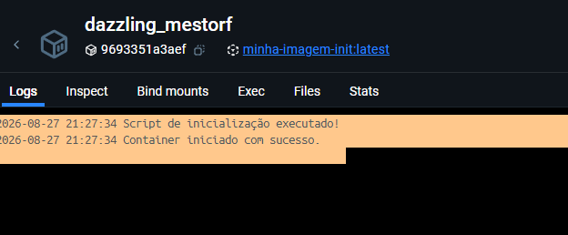

## Atividade 26: Usando Docker Secrets
1. Crie um secret com `echo "minha-senha" | docker secret create minha-senha -`.
2. Use o secret em um serviço do Docker Swarm.

## Atividade 27: Backup de volumes
1. Execute `docker run --rm -v meu-volume:/data -v $(pwd):/backup ubuntu tar cvf /backup/backup.tar /data`.
2. Verifique o arquivo de backup.

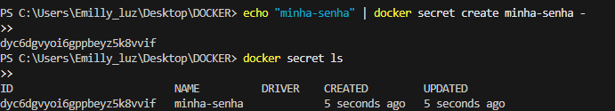


## Atividade 28: Restaurando volumes
1. Execute `docker run --rm -v meu-volume:/data -v $(pwd):/backup ubuntu bash -c "tar xvf /backup/backup.tar -C /data"`.
2. Verifique os dados restaurados.

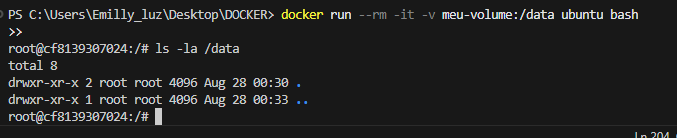

## Atividade 29: Configurando um proxy reverso
1. Crie um container Nginx como proxy reverso para outro serviço.
2. Teste o acesso através do proxy.

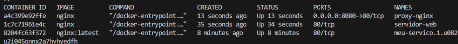

## Atividade 30: Limpeza de recursos
1. Remova todos os containers parados com `docker container prune`.
2. Remova todas as imagens não utilizadas com `docker image prune`.

Essas atividades têm como objetivo proporcionar uma compreensão prática e abrangente do Docker, permitindo que os alunos aprendam a usar a ferramenta de forma eficaz.