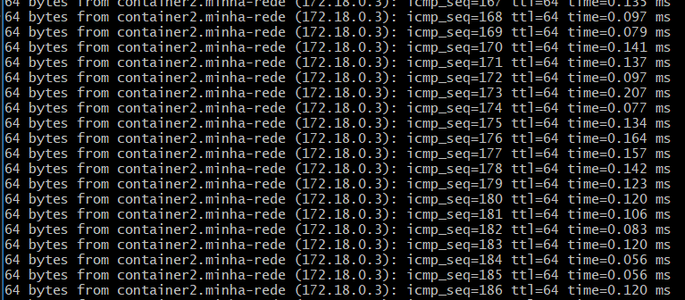

# Atividade 3 — Passo a passo prático de Docker

Relatório com as 30 atividades do enunciado, executadas de fato no ambiente local (Docker Desktop, backend Hyper-V, Windows 11 com Git Bash). Cada seção traz o comando rodado, a saída relevante e a explicação do que aconteceu.

Uma observação vale para o relatório inteiro: o enunciado original usa `docker-compose` (sintaxe da versão 1, com hífen). O Docker Desktop atual só traz o plugin `docker compose` (versão 2, como subcomando, sem hífen), então todos os comandos de compose aqui foram adaptados para essa sintaxe.

## Atividade 1: Instalação do Docker

```
docker --version
```

Instalação já validada em etapa anterior do curso (configuração do ambiente profissional), aqui só confirmamos que o daemon segue ativo e a versão instalada.

## Atividade 2: Executando o primeiro container

```
docker run hello-world
```

A própria saída do comando explica o fluxo: o cliente Docker pediu a imagem `hello-world`, o daemon não tinha ela localmente, então baixou do Docker Hub, criou um container a partir dela, executou o binário `/hello` que só imprime uma mensagem, e o container encerrou assim que o processo terminou. Isso mostra o ciclo básico de cliente, daemon e registry funcionando junto.

## Atividade 3: Listando containers

```
docker ps -a
```

A diferença entre container em execução e parado aparece na coluna STATUS. Um container em execução mostra `Up` seguido do tempo, enquanto um parado mostra `Exited` com o código de saída entre parênteses, por exemplo `Exited (0)` quando terminou sem erro. Um container roda enquanto o processo principal dele está ativo, assim que esse processo termina, o container passa para o estado parado, mas continua existindo até ser removido.

## Atividade 4: Criando um container interativo

```
docker run -it ubuntu bash
```

Dentro do container:
```
apt-get update
exit
```

Depois de sair, `docker ps -a` mostrou o container com status `Exited`. Isso evidencia uma diferença importante em relação a containers rodando em segundo plano: um container interativo depende do processo de shell que foi aberto, quando esse shell fecha (via `exit`), o processo principal termina e o container também para, mesmo tendo instalado coisas dentro dele durante a sessão.

## Atividade 5: Removendo um container

```
docker ps -a
docker rm dece51a54d30
```

O `docker rm` só remove containers que já estão parados, tentar remover um container em execução sem a flag `-f` resulta em erro. Depois do comando, o container some da listagem do `docker ps -a`, diferente de só pará-lo, que mantém o registro na lista com status `Exited`.

## Atividade 6: Criando uma imagem Docker

Dockerfile criado em pasta de teste separada:
```dockerfile
FROM ubuntu
RUN apt-get update && apt-get install -y curl
```

```
docker build -t minha-imagem .
docker images
```

O build gerou a imagem `minha-imagem:latest` com sucesso, usando o Ubuntu como base e instalando o curl. Cada instrução do Dockerfile vira uma camada na imagem final, e o Docker guarda cache dessas camadas para acelerar rebuilds futuros.

## Atividade 7: Executando uma imagem

```
docker run minha-imagem
```

O container sobe e encerra imediatamente, sem nenhuma saída. Isso acontece porque o Dockerfile não define um `CMD`, então o container executa apenas o comportamento padrão da imagem base (Ubuntu), que não tem nenhum processo de longa duração configurado. A imagem em si só entrega um sistema com curl instalado, não faz nada sozinha sem um comando explícito.

## Atividade 8: Criando um container em segundo plano

```
docker run -d nginx
docker ps
```

Com `-d` o container roda desacoplado do terminal (modo *detached*), o comando retorna na hora e o container continua ativo em segundo plano, diferente do modo interativo da atividade 4.

## Atividade 9: Expondo portas

```
docker run -d -p 8080:80 nginx
curl http://localhost:8080
```

O mapeamento `-p 8080:80` liga a porta 8080 da máquina host à porta 80 do container, onde o nginx escuta por padrão. A requisição feita na porta 8080 do host chega até o servidor dentro do container.

## Atividade 10: Usando volumes

```
docker volume create meu-volume
docker run -d -v meu-volume:/data nginx
docker volume ls
```

O volume é uma forma de persistir dados fora do ciclo de vida do container, o conteúdo gravado em `/data` dentro do container continua existindo mesmo que o container seja removido, porque fica gerenciado pelo Docker de forma independente.

## Atividade 11: Inspecionando um container

```
docker ps
docker inspect 091788c1cdc2
```

O `docker inspect` retorna um JSON completo com toda a configuração do container: endereço IP interno, portas mapeadas, volumes montados, variáveis de ambiente, comando de entrada e diversas outras metainformações usadas pelo Docker para gerenciar aquele container especificamente.

## Atividade 12: Conectando-se a um container em execução

```
docker exec -it 091788c1cdc2 bash
apt-get update
exit
```

Diferente do `docker run`, que cria um container novo, o `docker exec` abre uma sessão dentro de um container que já está rodando. Ao sair com `exit`, apenas a sessão interativa é encerrada, o container continua em execução normalmente, porque o processo principal dele (o nginx) nunca foi interrompido.

## Atividade 13: Criando uma rede Docker

```
docker network create minha-rede
docker network ls
```

Redes Docker permitem que containers se comuniquem entre si de forma isolada do restante da máquina host, cada rede criada aparece com seu próprio driver (nesse caso, `bridge`, o padrão para comunicação local entre containers).

## Atividade 14: Conectando containers à rede

```
docker run -d --network minha-rede --name container1 nginx
docker run -d --network minha-rede --name container2 nginx
docker exec -it container1 bash
apt-get update && apt-get install -y iputils-ping
ping container2
```



O ping teve 0% de perda de pacotes, confirmando comunicação total entre os dois containers. O ponto central aqui é a resolução por nome: dentro da rede `minha-rede`, o Docker mantém um DNS interno que resolve o nome do container (`container2`) para o IP correto automaticamente, sem precisar configurar IP fixo manualmente.

## Atividade 15: Usando Docker Compose

```yaml
services:
  web:
    image: nginx
    ports:
      - "8080:80"
```

```
docker compose up -d
curl http://localhost:8080
```

Na primeira tentativa, o comando falhou com erro de porta já alocada, porque um container antigo da atividade 9 ainda estava rodando na porta 8080. Depois de parar esse container antigo e rodar `docker compose down` seguido de `docker compose up -d`, o serviço subiu corretamente, criando uma rede própria para o projeto e um container nomeado automaticamente a partir do diretório. Esse episódio mostrou na prática por que conflitos de porta acontecem e como o compose gerencia rede e container de forma integrada a partir de um único arquivo de configuração.

## Atividade 16: Parando serviços com Docker Compose

```
docker compose down
docker ps -a
```

O `docker compose down` remove o container e a rede criados pelo compose, diferente de um simples `stop`, que apenas pausa o container mantendo-o na lista. Depois do down, o container do compose não aparece mais nem em `docker ps -a`.

## Atividade 17: Atualizando uma imagem

```dockerfile
FROM ubuntu
RUN apt-get update && apt-get install -y curl
RUN apt-get install -y wget
```

```
docker build -t minha-imagem .
docker images
```

No rebuild, a camada referente ao curl veio do cache (marcada como `CACHED` na saída do build), já que não mudou desde a última vez. Apenas a nova instrução (instalação do wget) foi de fato executada. Isso demonstra o sistema de camadas do Docker: cada instrução do Dockerfile vira uma camada, e camadas que não mudaram são reaproveitadas em builds seguintes, tornando o processo mais rápido.

## Atividade 18: Tagging de imagens

```
docker tag minha-imagem minha-imagem:v1
docker images
```

As duas tags (`minha-imagem:latest` e `minha-imagem:v1`) apontam para o mesmo ID de imagem. Criar uma tag não duplica o conteúdo da imagem, apenas cria um apelido adicional referenciando o mesmo conjunto de camadas, útil para versionar sem consumir espaço em disco extra.

## Atividade 19: Publicando uma imagem no Docker Hub

```
docker login
docker tag minha-imagem lucastrvss/minha-imagem:v1
docker push lucastrvss/minha-imagem:v1
```

Na saída do push, duas camadas aparecem como `Mounted from library/ubuntu` em vez de `Pushed`. Isso acontece porque essas camadas já existiam publicamente no Docker Hub (fazem parte da imagem base do Ubuntu), então o registry apenas referenciou o conteúdo já existente, evitando reenviar os mesmos dados. Só as camadas exclusivas da imagem (curl e wget instalados) foram efetivamente enviadas.

## Atividade 20: Baixando uma imagem do Docker Hub

```
docker pull nginx
docker images
```

A saída retornou `Status: Image is up to date for nginx:latest`, ou seja, o Docker comparou o digest da imagem local com o do registry e concluiu que já tinha a versão mais recente, sem precisar baixar nada novamente.

## Atividade 21: Criando um container com variáveis de ambiente

```
docker run -e "MY_VAR=Hello" ubuntu env
```

A variável `MY_VAR=Hello` apareceu na listagem junto das variáveis padrão do sistema (`PATH`, `HOME`, `HOSTNAME`), confirmando que a flag `-e` injeta variáveis de ambiente diretamente no processo do container no momento da criação.

## Atividade 22: Limitando recursos do container

```
docker run -m 512m --cpus="1.0" ubuntu echo "container limitado criado"
```

As flags `-m` e `--cpus` definem tetos máximos de uso de memória e CPU para o container, nesse caso 512 megabytes de RAM e o equivalente a uma CPU inteira. O limite não aparece diretamente na saída do terminal porque é aplicado na camada de isolamento do container (cgroups no Linux), e só se manifestaria caso o processo tentasse consumir mais do que o permitido, sendo então restringido ou encerrado pelo kernel.

## Atividade 23: Usando Dockerfile multi-stage

```dockerfile
FROM node:18 AS build
WORKDIR /app
RUN echo "build stage"

FROM node:18-alpine
WORKDIR /app
COPY --from=build /app .
CMD ["node", "-e", "console.log('multi-stage ok')"]
```

```
docker build -t minha-imagem-multi .
docker run minha-imagem-multi
```

O build passou por duas fases distintas: a fase `build`, baseada na imagem completa do Node 18, e a fase final, baseada na versão `alpine`, bem mais enxuta. O objetivo do multi-stage é justamente esse: usar uma imagem robusta (com todas as ferramentas necessárias) apenas durante a construção, e entregar o resultado final numa imagem final muito mais leve, sem carregar as ferramentas de build para o ambiente de execução real.

## Atividade 24: Monitorando containers

```
docker stats --no-stream
```

A flag `--no-stream` foi usada para capturar uma única leitura, já que por padrão o `docker stats` fica atualizando continuamente. A saída mostra uso de CPU, memória (absoluta e percentual em relação ao limite disponível na VM do Docker Desktop), tráfego de rede e I/O de disco por container. Como os containers estavam parados/ociosos, o consumo apareceu bem baixo, próximo de zero, o que reforça a diferença entre esse uso real medido em tempo de execução e os limites máximos configurados na atividade 22, que são apenas tetos, não consumo efetivo.

## Atividade 25: Criando um container com script de inicialização

```dockerfile
FROM ubuntu
COPY init.sh /init.sh
RUN chmod +x /init.sh
CMD ["/init.sh"]
```

```
docker build -t imagem-init .
docker run imagem-init
```

O container executou o script `init.sh` automaticamente ao iniciar, imprimindo a mensagem definida nele. Isso acontece porque o `CMD` do Dockerfile aponta diretamente para o script, então ele passa a ser o processo principal do container, executado assim que ele sobe.

## Atividade 26: Usando Docker Secrets

```
docker swarm init
echo "minha-senha" | docker secret create minha-senha -
docker secret ls
docker service create --name teste-secret --secret minha-senha nginx
docker service ls
docker service rm teste-secret
docker swarm leave --force
```

Secrets do Docker só funcionam em modo Swarm, por isso o primeiro passo foi inicializar o Swarm localmente. O secret foi criado a partir da saída do `echo`, ficando disponível de forma criptografada para os serviços que o referenciam, diferente de uma variável de ambiente, o secret é montado como arquivo dentro do container (em `/run/secrets/`), não fica visível em comandos como `docker inspect`. Depois de validar que o serviço subiu usando o secret, o serviço e o modo Swarm foram desfeitos para não deixar a máquina configurada dessa forma sem necessidade.

## Atividade 27: Backup de volumes

```
docker run --rm -v meu-volume:/data -v $(pwd)/teste-imagem:/backup ubuntu tar cvf /backup/backup.tar /data
```

O comando cria um container temporário (removido automaticamente ao final, por causa do `--rm`) que monta o volume a ser copiado e uma pasta do host lado a lado, e usa o `tar` para compactar o conteúdo do volume num arquivo salvo diretamente na pasta do host. Assim, mesmo que o volume seja perdido depois, existe uma cópia física do conteúdo fora do Docker.

## Atividade 28: Restaurando volumes

```
docker run --rm -v meu-volume:/data -v $(pwd)/teste-imagem:/backup ubuntu bash -c "tar xvf /backup/backup.tar -C /data"
```

Esse comando faz o caminho inverso do backup: lê o arquivo `.tar` salvo no host e extrai o conteúdo de volta dentro do volume, restaurando os dados originais.

## Atividade 29: Configurando um proxy reverso

```
docker run -d --name backend --network minha-rede nginx
```

`nginx.conf`:
```
events {}
http {
  server {
    listen 80;
    location / {
      proxy_pass http://backend:80;
    }
  }
}
```

```
docker run -d --name proxy --network minha-rede -p 8081:80 -v $(pwd)/nginx.conf:/etc/nginx/nginx.conf:ro nginx
curl http://localhost:8081
```

Apenas o container `proxy` teve porta publicada para o host (8081), o `backend` ficou acessível somente dentro da rede interna `minha-rede`. A requisição feita na porta 8081 chegou ao container proxy, que por sua vez encaminhou a chamada internamente para `http://backend:80`, usando a resolução de nome do DNS interno do Docker (o mesmo mecanismo já observado na atividade 14). O retorno da página padrão do nginx confirma que o redirecionamento funcionou de ponta a ponta.

## Atividade 30: Limpeza de recursos

```
docker rm -f backend proxy container1 container2 stoic_johnson zen_gagarin admiring_goldberg interesting_liskov musing_brown relaxed_knuth
docker container prune -f
docker image prune -f
```

Por fim, todos os containers de teste criados ao longo das atividades foram removidos, e o `prune` limpou containers parados e imagens não utilizadas que restaram no processo, incluindo resíduos de sessões anteriores do curso. Esse comando resume bem o propósito da atividade: ao longo dos testes é normal acumular containers e imagens que não são mais necessários, e a limpeza periódica evita desperdício de espaço em disco.
